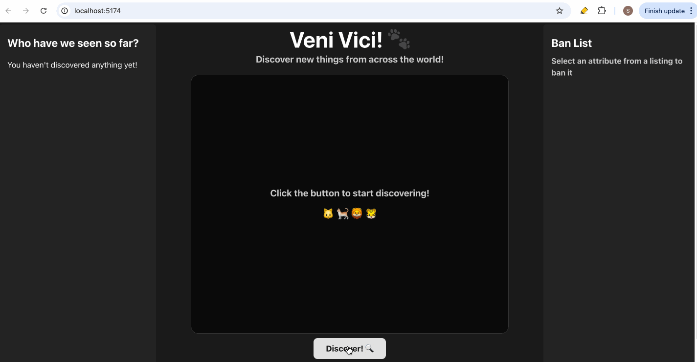

# Web Development Project 4 - *Veni-Vici*

Submitted by: **Syeda Haque**

# 🐈 Veni Vici! Discover Cats from Around the World

**Veni Vici!** is a dynamic React application designed for feline enthusiasts and curious explorers alike. Leveraging **The Cat API**, this platform allows users to discover a vast array of cat breeds from around the world through an interactive and randomized interface.

The core philosophy of the app—*Veni, Vici* (I came, I conquered)—is reflected in the user's ability to "conquer" their discovery feed using a custom-built **Ban List** system. By filtering out specific attributes like breed names, origins, or weight classes, users can curate a personalized exploration experience.

Time spent: **4** hours spent in total

## Required Features

The following **required** functionality is completed: 

- [x] **Application features a button that creates a new API fetch request on click and displays at least three attributes and an image obtained from the returned JSON data**
  - The type of attribute displayed for each image should be consistent across API calls (i.e. if you are using a cat API, and display the color, breed, and age in response to an initial API call, subsequent button clicks should also result in the color, breed, and age being displayed)
- [x] **Only one item/data from API call response is viewable at a time and at least one image is displayed per API call**
  - A single result of an API call is displayed at a time 
  - Displayed attributes should match the displayed image (i.e., if showing a picture of a Siamese cat and the attribute breed, the displayed breed should be 'Siamese' not 'Ragdoll' or another breed that doesn't match)
  - There is at least one image per API call
- [x] **API call response results should appear random to the user**
  - Clicking on the API call button should generate a seemingly random new result each time
  - Note: Repeat results are permitted but the API used should have a reasonably large amount of data and repeats should not be frequent
- [x] **Clicking on a displayed value for one attribute adds it to a displayed ban **list**
  - At least one attribute for each API result should be clickable
  - Clicking on a clickable attribute not on the ban list, should imnmediately add it to the ban list 
  - Clicking on an attribute in the ban list should immediately remove it from the ban list 
- [x] **Attributes on the ban list prevent further images/API results with that attribute from being displayed**
  - Clicking on the API call button should not result in any image/attributes with attribute values in the ban list being displayed (ex. Using a cat API, if the ban list includes the value 'Siberian' for the breed attribute, clicking on the Discover button should never result in a Siberian cat being displayed)
  - Note: More attribute values on the ban list may result in a higher frequency of repeat results
  -  [x] _To ensure an accurate grade, your recording **must** show that when clicked, an attribute in the ban list is immediately removed from the list of banned attributes_

The following **optional** features are implemented:

- [x] Multiple types of attributes are clickable and can be added to the ban list
- [x] Users can see a stored history of their previously displayed  results from this session
  - A dedicated section of the application displays all the previous images/attributes seen before
  - Each time the API call button is clicked, the history updates with the newest API result

The following **additional** features are implemented:

* [x] List anything else that you added to improve the site's functionality!

## Video Walkthrough

Here's a walkthrough of implemented required features:

GIF created with LICEcap

## Notes

Describe any challenges encountered while building the app.

## License

    Copyright [yyyy] [name of copyright owner]

    Licensed under the Apache License, Version 2.0 (the "License");
    you may not use this file except in compliance with the License.
    You may obtain a copy of the License at

        http://www.apache.org/licenses/LICENSE-2.0

    Unless required by applicable law or agreed to in writing, software
    distributed under the License is distributed on an "AS IS" BASIS,
    WITHOUT WARRANTIES OR CONDITIONS OF ANY KIND, either express or implied.
    See the License for the specific language governing permissions and
    limitations under the License.
